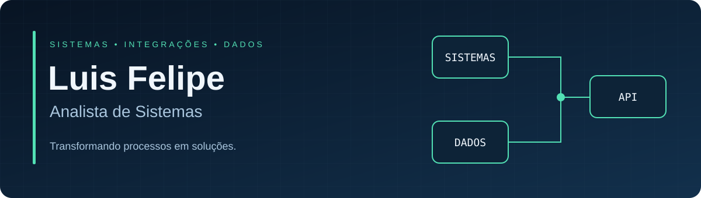

<a href="https://www.linkedin.com/in/luisfelipeeg1/">LinkedIn</a> &nbsp;•&nbsp;
<a href="https://www.luisfelipegn.com/">Portfólio</a> &nbsp;•&nbsp;
<a href="https://github.com/jovemfelpitos/luisfelipegn/tree/main/portfolio">Todos os projetos</a>

### Olá, sou o Luis Felipe.

Analista de Sistemas. Desenvolvo **sistemas internos, integrações e automações** que conectam processos e dados.

**Python · PHP · JavaScript · SQL · APIs REST**

### Projetos em destaque

- [CRM interno](https://github.com/jovemfelpitos/internal-crm-case-study) — Gestão de clientes, permissões e auditoria.
- [Governança de leads](https://github.com/jovemfelpitos/lead-governance-case-study) — Qualidade de dados e integração de processos.
- [Central SMS](https://github.com/jovemfelpitos/luisfelipegn/tree/main/portfolio/cases/sms-operations) — Integrações e operação de atendimento.

[Explore os demais projetos e estudos de caso →](https://github.com/jovemfelpitos/luisfelipegn/tree/main/portfolio)
